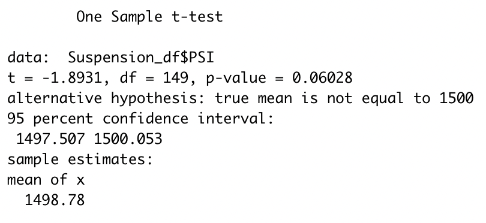

# MechaCar_Statistical_Analysis

## Overview
This statistical analysis was completed using R and added libraries such as dplyr. "AutosRUs" is an automobile company that is looking for analytical help with the "MechaCar" prototype. There are some production troubles with the manufacturing of the vehicle, so this analysis was completed to help give direction and insight to the manufacturing team in order to create a successful, profitable vehicle in the "MechaCar".  
_________________________________________
## Linear Regression to Predict MPG (Deliverable 1)

A linear regression on the MechaCar data was completed that focused on the variance of mpg values when compared to other metrics of the vehicle (i.e. vehicle weight, ground clearance, etc.). This data is summarized in the image below: 

#(Summary of data)
#(Which variables/coefficients provided a non-random amount of variance to the mpg values in the dataset?)
#(Is the slope of the linear model considered to be zero? Why or why not?)
#(Does this linear model predict mpg of MechaCar prototypes effectively? Why or why not?)

_________________________________________
## Summary Statistics on Suspension Coils (Deliverable 2)

#(Intro)

#(Summary of data)
#(The design specifications for the MechaCar suspension coils dictate that the variance of the suspension coils must not exceed 100 pounds per square inch. Does the current manufacturing data meet this design specification for all manufacturing lots in total and each lot individually? Why or why not?)

_________________________________________
## T-Tests on Suspension Coils (Deliverable 3)

#(Summary/findings of TTest results)

_________________________________________
## Study Design: MechaCar vs Competition (Deliverable 4)

#(Short description of study that can quantify how MechaCar performs against competition)
  #(What metric or metrics are you going to test?)
  #(What is the null hypothesis or alternative hypothesis?)
  #(What statistical test would you use to test the hypothesis? And why?)
  #(What data is needed to run the statistical test?)

