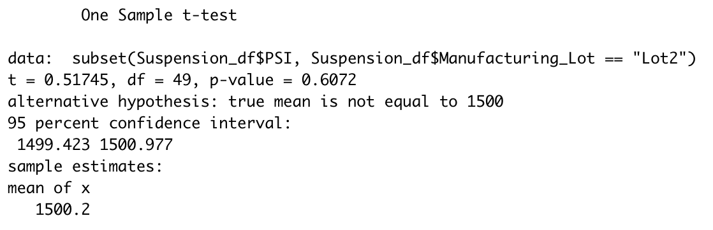

# MechaCar_Statistical_Analysis

## Overview
This statistical analysis was completed using R and added libraries such as dplyr. "AutosRUs" is an automobile company that is looking for analytical help with the "MechaCar" prototype. There are some production troubles with the manufacturing of the vehicle, so this analysis was completed to help give direction and insight to the manufacturing team in order to create a successful, profitable vehicle in the "MechaCar".  
_________________________________________
## Linear Regression to Predict MPG (Deliverable 1)

A linear regression on the MechaCar data was completed that focused on the variance of mpg values when compared to other metrics of the vehicle (i.e. vehicle weight, ground clearance, etc.). This data is summarized in the image below: 

This data in the image above shows a multiple linear regression model that was executed on the mpg data.  The multiple R-squared value can be seen as 0.715, while the Adjusted R-squared value is 0.683.  It is safe to say that there is a moderate-to-strong correlation between the mpg of the MechaCar prototypes and some of the characteristics of the vehicles such as vehicle length and ground clearance. The findings from the data are further described below. 

The variables that provided a non-random amountof variance to the mpg values in this dataset were the vehicle length (p-value = 2.60e-08), ground clearance (p-value = 5.21e-08), and intercept (which is mpg in this analysis, p-value = 5.08e-08). All three of these variables have p-values that are much smaller than 0.05, so it can be assumed that they have a strong correlation to the mpg of the vehicle (rather than the mpg being affected by chance/random).

The slope of the linear model is not zero, since the p-value of the analysis is 5.35e-11.  Since this p-value is much smaller than the significance level of p = 0.05, there is strong evidence to reject the null hypothesis and assume that the slope of the linear model is not zero. 

#(Does this linear model predict mpg of MechaCar prototypes effectively? Why or why not?) This linear model does predict the mpg of MechaCar prototypes effectively because it has a high R-squared value (0.715), and it also has a p-value much smaller than the significance level.  Both of these factors show that the model is effective at predicting the mpg values of the cars and what factors specifically should be focused on when changing car designs in order to achieve an ideal mpg reading.  

_________________________________________
## Summary Statistics on Suspension Coils (Deliverable 2)

The images below show an analysis completed for the MechCar that focuses on the suspension coils.  This quick analysis was completed in order to look at the total summary of PSI variance and other metrics of all manufacturers, and then at individual lots of manufacturers. 

All in all, the total summary table above shows that the variance of PSI for all of their manufacturers is 62.29.  This falls within their variance limit of not exceeding 100 PSI.  So technically, they meet their goal, but a deeper dive into the data uncovers an issue.  If you analyze the individual manufacturing lots of the coils in the bottom image, it shows that Lot 3 seems to be at a variance level of PSI of 170.29.  Even though the overall variance level is below 100 PSI for all manufacturers, there should be a massive intervention with Lot 3 in order to bring the variance down to a lower, safer level.  The other lots both have very low variance rates, so there are most likely some differences in methods that can be shared amongst the lots in order to lower variance amongst the PSI in the coils in Lot 3. If changes can't be made, then Lot 3 will be a liability regarding safety and consistency with the high variances in PSI, which could lead to injury and/or setbacks in the building process.    

_________________________________________
## T-Tests on Suspension Coils (Deliverable 3)

As seen in the image above, a t-test was performed on the Coils as well.  The image above shows that the overall p-value from this t-test is 0.06, which is larger than the significance value of 0.05.  This means that overall, the manufacturers are not performing significantly different compared to the standard of 1500 PSI.  

The images below show the same t-test analysis on the individual manufacturing lots.  The p-values for Lot 1 (p-value = 1) and Lot 2 (p-value = 0.61) are larger than the significance value of 0.05.  Therefore, these lots are not significantly different from the standard 1500 PSI.  Lot 3, though, has a p-value of 0.04 which is smaller than the 0.05 significance value.  This means that Lot 3 is performing significantly different than the standard, and this ties together with the PSI data that was analyzed above for variance.  With the high variance of PSI in this lot, there is most likely some inefficiencies that are occuring that are making the lot significantly different from the standard of 1500 PSI.  

_________________________________________
## Study Design: MechaCar vs Competition (Deliverable 4)
  
In order to find out how the MechaCar is doing against the competition, it would be important to consider the safety rating of all the vehicle data that can be obtained from both the MechaCar prototypes and also the competitor vehicles that have similar attributes. Some vehicle metrics that could be analyzed are safety rating, ground clearance, vehicle length, and vehicle weight.  These variables could be chosen since they all add physical attributes to the car that in theory should affect the safety rating during a crash. 

Null Hypothesis: The MechaCar does not have a significantly higher safety rating than its competitors when using a significance level of 0.05.  

The statistical test that would be used for this analysis would be a multiple linear regression.  If there is more variance in the MechaCar data with regards to the safety rating, then there should be physical changes to the makeup of the prototype in order to increase safety.  A multiple linear regression model would show which physical attributes of every vehicle are correlated with the safety rating, and also which vehicles seem to have the safest rating from these variables.  If the MechaCar comes out with the least amount of variance, they are leading the market in safety with regards to the physical design of the car. Other technological/interior safety features should also be considered, but with manufacturing in mind, this analysis would be very helpful to the design team in order to compete with the market.  This analysis could also show if these physical attributes even correlate with the safety value at all (high R-value = high correlation, low R-value = low correlation). A high safety value is sought after, so identifying the main drivers of that safety value are important for manufacturing. 

The data that is needed to run the test would be continuous data of the safety ratings of all comparable vehicles to the MechaCar (and the MechaCar prototype) - as the dependent variable; and continuous data of the ground clearance, vehicle lengths, and vehicle weights of all comparable vehicles to the MechaCar and the prototypes.  Since these figures should all be in numerical, continuous values already for these variables, the multiple linear regression model should be easy to carry out.  

